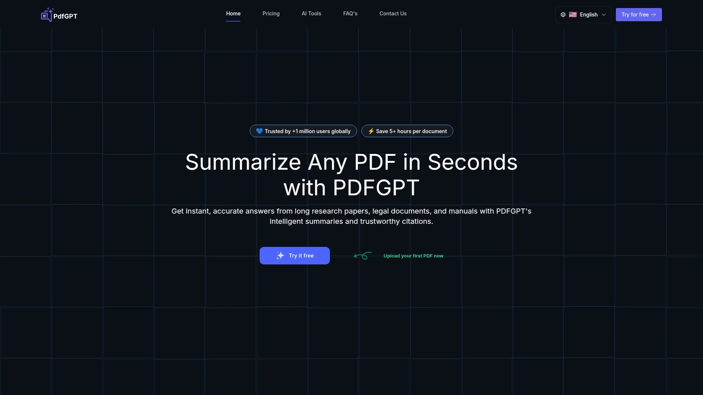

# Top 20 Document AI Tools Ranked in 2025 (Latest Compilation)

Are you drowning in reports, legal papers, or research articles? Document AI tools can throw you a lifeline. These clever platforms use artificial intelligence to **summarize**, **analyze**, and **simplify** complex documents, so you can grasp key points in minutes instead of hours. Whether you’re a lawyer buried in case files or a student with piles of PDFs, the right tool can dramatically cut down your reading time while boosting accuracy and insight. Below we’ve rounded up the top solutions in 2025 for AI-driven **document analysis** and summarization – each promising to make your life easier by tackling tedious text and delivering results that are more **efficient** and **precise** than manual reading.

## **[DocuEase](https://docuease.com)**
*AI-powered legal document assistant for fast analysis and plain-language summaries.*

**DocuEase** is built for legal professionals and businesses that deal with dense documents daily. It leverages cutting-edge NLP to **summarize lengthy contracts, case files, and reports**, extracting the key points and flagging important details. Lawyers love how it simplifies complex **legal jargon** into client-friendly language and highlights precedents or obligations buried in text. With DocuEase’s in-depth analysis, you can identify patterns and potential outcomes to inform your strategy. It even supports multi-language translation for international cases. **Why it stands out:** DocuEase operates at lightning speed – reviewing hundreds of pages within minutes without missing details. This means what used to take all day can now be done over a coffee break, with consistent accuracy. If you need a tireless AI partner to streamline document review, DocuEase delivers a clear **competitive advantage** for law firms and any workflow heavy on documentation.

## **[Mindgrasp](https://www.mindgrasp.ai)**
*Instant summaries and Q&A from any text for students, professionals, and curious minds.*

**Mindgrasp** acts like your personal reading assistant – you feed it articles, PDFs, or even transcripts, and it quickly generates concise notes and summaries. It’s popular among students and researchers who use it to digest textbooks or journal articles. **Key features:** Mindgrasp doesn’t stop at summarizing; it also lets you **ask questions** about the content and provides clear answers, essentially quizzing the document for you. The AI handles various file formats (PDFs, Word, videos, you name it) and produces easy-to-understand explanations. Professionals in fields like law or business also use Mindgrasp to break down complex reports or contracts into bite-sized insights. There’s even collaboration support for sharing notes with colleagues. With a free trial available, Mindgrasp can revolutionize how you research, study, and absorb information – no more rereading pages endlessly to find the gist.

## **[QuillBot](https://quillbot.com)**
*Your all-in-one text rewriting and summarizing companion trusted by millions.*

**QuillBot** is famous for its AI paraphrasing tool, but it also offers a powerful **summarizer** that turns long articles or papers into brief key points. This makes it a favorite for anyone from content writers to students trying to get the essence of source material. In practice, QuillBot’s summarizer can take a multi-page document and spit out a neat paragraph or list of the most important information. Meanwhile, its paraphrasing tool helps you rephrase sentences in clear, fluent language – perfect for simplifying a dense clause or improving a rough draft. **What’s great:** QuillBot is extremely easy to use. Just paste your text and choose modes like Short or Concise summary. It also integrates with browsers and Word, streamlining your workflow. The free version offers basic functionality, and the premium upgrade is affordable, making QuillBot a handy AI writing sidekick for boosting clarity and saving time on reading assignments.

## **[Humata](https://humata.ai)**
*Chat with your files – an AI that answers questions and summarizes documents.*

Imagine uploading a document and **chatting** with an AI about its contents – that’s **Humata** in a nutshell. This tool lets you ask any question about your PDF or text file, and it will find the answer for you as if the document itself is responding. Humata excels at generating quick summaries and extracting insights from research papers, technical manuals, legal documents, you name it. It supports large files and provides results in seconds, which is a lifesaver if you’re short on time. Many users describe Humata as having a “second brain” for their files – you no longer have to manually skim for answers or main ideas. **Use cases:** A student can ask Humata to explain a difficult paragraph in simpler terms; a lawyer can query a contract for specific clauses; a manager can get an instant summary of a long report before a meeting. With an intuitive interface and growing popularity, Humata is pushing the envelope in document Q&A. It offers a free tier for light use and subscription plans for heavy workloads.

## **[Legalese Decoder](https://legalesedecoder.com)**
*Translates complex legal jargon into plain English (so you actually understand it).*

Facing a wall of **legalese**? **Legalese Decoder** is built to help. As the name suggests, this AI tool takes confusing legal documents – think terms & conditions, contracts, statutes – and rephrases them in clear, everyday language. It uses natural language processing trained on legal text to ensure accuracy in translation. **Who benefits:** This is perfect for lawyers who need to quickly simplify documents for clients, or for individuals reviewing a lease or agreement without a lawyer on hand. The interface is straightforward: paste your legal text and get an explanation section-by-section in layman’s terms. Legalese Decoder’s AI doesn’t just dumb down the language; it preserves the key details and obligations, so you’re informed without being misled. It’s a web app, no install required. **Bonus features:** Some versions of the tool also highlight critical clauses or provide summaries of each paragraph. For anyone who’s ever felt lost in legal jargon, Legalese Decoder is like having a personal translator for the fine print.

## **[ChatDOC](https://chatdoc.com)**
*AI chatbot for PDFs that finds answers and summarizes long documents effortlessly.*

**ChatDOC** turns your static PDF into an interactive Q&A session. Simply upload a document, and you can start asking the AI questions about its content – *“What are the main conclusions of this report?”* or *“What does section 5 imply?”* – and get instant answers. It’s built on advanced language models that have read your text, so it responds with details drawn directly from the document. **Why you’ll love it:** It saves an incredible amount of time when dealing with lengthy PDFs, like research papers, legal briefs, or technical guides. Instead of manually searching or reading line by line, you ask ChatDOC and it points you to the relevant info. It also provides **summaries on demand**, giving you a quick overview of the entire document. ChatDOC supports complex and large PDF files (hundreds of pages), and often can handle multiple languages. The free version lets you try it on smaller documents, while premium plans unlock bigger file support. For anyone who regularly needs to extract insights from documents, ChatDOC feels like magic – it’s like conversing with the document itself to get exactly what you need.

## **[Scholarcy](https://www.scholarcy.com)**
*AI research paper summarizer that creates flashcard-like breakdowns.*

If you’re in academia or just trying to digest dense scholarly articles, **Scholarcy** is a lifesaver. This online tool reads academic papers (PDFs or HTML) and generates an easy-to-read summary with the key points, complete with a bullet-point rundown of findings and even a highlight of important contributions. Scholarcy’s unique twist is that it creates what they call “flashcards” for the article – sections like the study’s background, methods, results, and conclusions are neatly extracted. It also pulls out important **figures, tables, and references**, so you get the context without wading through the entire paper. **Who uses Scholarcy:** Students performing literature reviews, researchers scanning many papers for relevance, or professionals trying to stay updated on research trends. It can drastically reduce reading time and help you decide which papers to read fully. The tool offers a browser extension and integration with reference managers. While there is a subscription for heavy use, there’s a free trial and even a basic free plan that processes shorter articles. In short, Scholarcy helps you **read smarter** by turning long papers into digestible nuggets of knowledge.

## **[Genei](https://www.genei.io)**
*Research assistant that summarizes and analyzes multiple documents with ease.*

**Genei** is designed for deep research sessions. It not only **summarizes documents** (like PDFs, web pages, or Word files) but also allows you to search across your uploaded documents for specific ideas or keywords. It’s like having a smart index for everything you’ve read. For example, if you upload a batch of scientific papers, Genei can quickly tell you which ones mention a certain technique or give you a summary of each paper’s main points. This AI tool also supports asking questions: you can query your set of documents with natural language, and Genei will synthesize an answer drawn from all those sources. **Benefits:** It massively speeds up literature reviews, market research, or any task where you need to extract insights from a lot of text. Writers and analysts use Genei to pull facts from sources without manually combing each one. The interface allows side-by-side reading of original text and AI-generated notes. It’s intuitive and **cloud-based**, so no install needed. Genei offers a free trial, and paid plans for heavier usage, with student discounts available. If you have a mountain of reading to do, Genei helps you climb it in a fraction of the time.

## **[Logically (Afforai)](https://logically.app)**
*AI workspace for researchers – manage references, annotate PDFs, and get AI insights.*

**Logically**, formerly known as Afforai, is an AI-powered research assistant that goes beyond just summarizing. It provides an integrated workspace where you can **store and organize your reference papers**, make annotations, and then use AI to get summaries or explanations. Think of it as a virtual research hub: you upload articles or documents, and Logically can highlight important points, generate a quick summary of each, and even help draft literature reviews by collating information. It’s especially handy for students working on a thesis or researchers juggling many PDFs. One standout feature is its ability to **automate literature reviews** – you can ask it to find connections or comparisons between your sources. It also has a citation manager aspect, keeping track of references. **Ease of use:** The platform is user-friendly with a dashboard to see all your documents and AI outputs side by side. By using AI to reduce manual skimming and note-taking, Logically lets you focus on analysis and writing. It has a free tier for trying out, and premium plans if you need to manage a large research library. For academic or report-heavy projects, Logically is a huge productivity booster.

## **[Paperpal](https://paperpal.com)**
*Academic writing assistant that polishes your text and even chats with your PDFs.*

**Paperpal** is like an AI editor and researcher rolled into one, tailored for academia. Its core use is to improve your writing: you can draft a research paper or essay and Paperpal will **check grammar, suggest rewrites, and ensure your text meets formal academic standards**. It’s great at catching things like overly complex sentences or passive voice and offering clearer alternatives. But beyond writing help, Paperpal has an **AI Summarizer and a ChatPDF feature** built in. That means you can also upload a source PDF and get a summary or ask questions about it, right from the same platform where you’re writing. This makes it super convenient when you need to understand references while drafting your own work. **Why choose Paperpal:** It’s trusted by researchers and even integrated with tools like MS Word, Google Docs, and journal submission systems. It ensures your manuscript is not only well-written but also helps you quickly grasp any cited studies via its summarizer. Students can use it to refine assignments and quickly get the gist of readings. There’s a free trial for new users, and the premium version unlocks unlimited checks and the full suite of AI tools. If you aim to write better and smarter, Paperpal is a must-try.

## **[Wordtune](https://www.wordtune.com)**
*AI rewriter that makes your writing clearer and now helps summarize what you read.*

**Wordtune** started as a popular AI writing assistant for rephrasing sentences and improving tone. It’s like having a skilled editor available 24/7 – you highlight a sentence and Wordtune suggests clearer or more elegant ways to express it. It can also adjust the formality or shorten/expand your text as needed. This is incredibly useful when you’re dealing with complicated wording (like legal clauses or technical explanations) and need them in plainer language. Recently, the makers of Wordtune introduced **Wordtune Read**, a tool for summarizing documents and articles. So not only can Wordtune help you write, it can help you **understand** lengthy text by condensing it into a brief summary with key bullet points. The combo is great for professionals and students alike: imagine simplifying a dense report with Wordtune Read, then using Wordtune to incorporate those findings into your own document with polished prose. **User experience:** It offers a Chrome extension that works on any website or PDF, and it’s integrated with Google Docs. The free plan allows a limited number of rewrites per day, while the premium gives you unlimited access and the full power of its summarizer. Wordtune excels at making writing and reading more efficient, so you communicate smarter.

## **[AskYourPDF](https://askyourpdf.com)**
*Ask questions to any PDF and get instant answers – your document’s personal chatbot.*

As the name suggests, **AskYourPDF** lets you literally ask your PDF about its content. It’s an AI tool that loads your PDF file and then responds to your queries in a chat-like interface. If you’ve ever wished a lengthy document had an FAQ, this is essentially it – except *you* pose the questions. **How it works:** Upload a document (reports, e-books, research papers, etc.) and then type questions in plain English. For example, *“What’s the main argument of this paper?”* or *“List the key recommendations in this report.”* AskYourPDF will generate answers drawing from the text, often with references to which part of the PDF the answer came from. It can also produce a quick summary on request. **Benefits:** This saves you the hassle of search-within or manually scanning for info. It’s like having the author of the PDF on standby to clarify things. AskYourPDF is particularly handy for students digesting readings or professionals reviewing lengthy proposals. Many use it to confirm they didn’t miss any critical detail. The service typically offers a free usage tier (with limits on pages or questions) and a paid plan for heavy use with larger files. If you want a quick way to extract knowledge from documents, asking your PDF might be the smartest way to go.

## **[PDF.ai](https://pdf.ai)**
*AI-powered PDF assistant that summarizes and analyzes documents, with a sleek interface.*

**PDF.ai** is another entrant in the “chat with your PDF” arena, focused on a user-friendly experience. You upload a PDF and can immediately generate a summary or start querying the content. What sets PDF.ai apart is its clean design and sometimes faster response times. It’s built to handle complex documents, providing coherent answers even if the info is buried deep in tables or appendices. **Top features:** Beyond Q&A, PDF.ai often can extract structured data or create an outline of the document’s sections. This is super helpful for long reports or research with multiple sections – you get a quick outline to understand the structure before diving in. It also supports multi-page summarization, giving you a paragraph that captures the whole PDF’s essence. **Use cases:** Business analysts use it to break down market research reports, lawyers might use it to scan through case law PDFs, and students can simplify textbook chapters. If you have multiple PDFs, PDF.ai lets you manage them in a library and chat with each as needed. They advertise a generous free plan (with limits on pages per day) and subscription options for power users. With the promise of **30% faster comprehension**, PDF.ai appeals to those who value both speed and simplicity in interacting with documents.

## **[myStylus](https://mystylus.ai)**
*AI writing suite for students that can summarize texts and generate essays seamlessly.*

**myStylus** is like a Swiss Army knife for AI-assisted writing. Aimed largely at students and content creators, it offers tools to generate essays from scratch, rewrite paragraphs, check for grammar, and yes – **summarize content** too. If you have a long article or an e-book chapter, myStylus’s AI Summarizer will quickly distill it down to the main ideas, helping you absorb information faster or prepare notes. On the flip side, when you need to write, myStylus can help you draft sections or expand on bullet points. It even boasts the ability to bypass certain AI detectors, meaning it produces more “human-like” text (important for academic integrity and style). **Highlights:** The platform is comprehensive – beyond summarizing and paraphrasing, it has an **AI Essay Writer, an AI Proofreader, and even an AI Humanizer** to make text sound natural. Essentially, you can go from research to finished paper all within myStylus. For example, use the summarizer to read sources, then use the writing tools to craft your essay, and polish it with the grammar checker. It’s all in one place. The UI is student-friendly, and they claim high-quality output (many users report improved grades when using it as a support tool). myStylus typically operates on a subscription model, with robust affiliate partner support (lots of student influencers recommend it). If you want an all-in-one assistant to lighten your study load, myStylus might be your new best friend.

## **[PDFGPT](https://www.pdfgpt.io)**
*AI tool that combines the power of GPT with PDFs to automate document workflows.*

**PDFGPT** is an AI service that merges large language models (like GPT) with PDF understanding. In practice, it can **break down complex PDFs** and help you manage and analyze them in ways beyond just Q&A. For instance, PDFGPT can summarize documents, extract specific fields or data points, and even compare two PDFs for differences (useful for contracts or revised reports). It’s marketed as a productivity booster for anyone dealing with tons of documents – lawyers, researchers, finance professionals, etc. One cool feature: you can chain tasks, like “Summarize this report and then list any actionable recommendations separately.” It handles multi-step queries gracefully. **Why people use it:** PDFGPT often shines in business settings – imagine feeding in monthly sales reports and asking it to pull out trends, or using it to sift through a stack of résumés to find key qualifications. It essentially **automates document workflows** by letting the AI do the reading and initial analysis for you. The interface is straightforward: you upload files and interact via a chat or command prompt. They have a web version and possibly an API for integrating into your own apps. While a free trial might be available, serious use will require a subscription. For those looking to supercharge their document processing with AI, PDFGPT is a potent tool in the arsenal.

## **[JustDone AI](https://justdone.com)**
*Mega-suite of 140+ AI tools: write, summarize, check, and more – all in one place.*

**JustDone AI** lives up to its name by helping you get it “just done” when it comes to writing and content tasks. It’s not a single-purpose app; rather, it offers a buffet of AI tools ranging from content generation to SEO optimization. Relevant to our focus, JustDone includes an **AI Text Summarizer** as well as an **AI Document Summarizer** among its many features. This means you can feed it anything from a long article to a book PDF, and get a concise summary out. But it doesn’t stop there – you also have a **Paraphraser**, **AI Humanizer** (to make AI-written text sound human), grammar and plagiarism checkers, and even AI tools for creating quizzes or flashcards from text. It’s like having a whole suite of AI assistants accessible from one dashboard. **Ideal for:** Content creators, students, marketers, and professionals who juggle different tasks. Instead of subscribing to separate services for summarizing, writing, and checking, JustDone bundles it all (with a pretty generous affiliate program fueling its growth). The user interface categorizes tools so you can quickly switch between say, summarizing a source and then generating a blog section about it. They offer a free tier with basic usage of each tool, and paid plans for unlimited access. If you want one platform that can handle nearly any AI content need – reading, writing, or analyzing – JustDone is a compelling one-stop solution.

## **[HIX.AI](https://hix.ai)**
*All-in-one AI writing copilot that also summarizes text and chats with PDFs.*

**HIX.AI** markets itself as the “most powerful, all-in-one writing copilot,” and it’s not just hype – this platform packs a punch. It combines various AI writing capabilities (similar to Jasper or Writesonic) with extra bells and whistles. For document lovers, HIX has an **AI Summarizer** tool to shrink long texts down, and even a **ChatPDF** function to converse with documents, much like the dedicated PDF bots. But HIX’s main strength is content creation: you can generate articles, emails, social media captions, and more with its AI Writer. It also offers an **AI Translator**, **Email Writer**, **Essay Writer**, and the interesting **HIX Bypass** for creating content that can evade AI detection. For someone who needs both reading assistance and writing assistance, HIX has it all. **Experience:** You can use HIX through their web app, browser extension, or even a desktop app, making it accessible wherever you work. The UI guides you with templates and examples, so you don’t need to be an expert to get quality output. It’s a paid product but with a free trial, and they tout a hefty commission for referrals (hinting at a robust affiliate ecosystem). If you run a blog or handle tons of content, HIX.AI can help brainstorm, draft, polish, and summarize – essentially serving as an AI coworker to handle the heavy lifting.

## **[Jenni AI](https://jenni.ai)**
*AI writing assistant that can also sum up articles and sources while you write.*

**Jenni AI** is known for helping students and writers produce essays and articles with AI guidance. It works alongside you as you write – you start a sentence and Jenni can complete it or suggest the next line. It’s great for overcoming writer’s block and speeding up the drafting process. Now, why is Jenni on this list? Because it also has features to assist with **research and summarization**. As you write in Jenni, you can ask it to **summarize a source or provide references** for a claim. Jenni was one of the first AI writing tools to introduce inline citations: you could prompt it to back up a statement, and it would generate a sentence with a citation from a real source. This means Jenni not only helps write but also helps you gather and condense information from other texts. For example, if you have a source article, Jenni can summarize it or pull key points which you can then incorporate (with proper citation) into your essay. **Why people like it:** It feels like a knowledgeable writing partner. Students use Jenni to draft faster and ensure they have supporting evidence. Bloggers use it to generate content outlines and get quick research snippets. The interface is minimalistic – just a writing canvas with AI on tap. Jenni offers a free trial and then a subscription. If you need a writing buddy that can also do some reading for you, Jenni is a strong choice, blending content generation with summarization capabilities.

## **[TextCortex AI](https://textcortex.com)**
*Versatile AI writing tool with a handy browser extension to summarize and chat with any page.*

**TextCortex** is another all-round AI writing assistant, similar in spirit to HIX and Jasper, focusing on making content creation easier. It helps you generate marketing copy, blog sections, product descriptions – basically any text. However, TextCortex also has a trick up its sleeve: the **Browser Extension**, often referred to as “HyperWrite” or “Zeno Chat” mode, which can work on any website you visit. With this extension, you can do things like select text on a page and get a summary, or even chat with an AI about the content of a PDF or article you’re viewing (this functions like a chat-with-website feature). So, if you’re reading a Wikipedia page or a news article and need a quick gist or translation, TextCortex’s extension can provide it. **Key features:** It supports dozens of languages, offers rewriting and tone adjustment for your writing, and can also autocomplete your sentences as you type. Think of it as both a reading assistant and a writing enhancer that’s always available in your browser. It’s beloved by professionals who draft emails and documents directly in their web browser – the AI can suggest improvements on the fly. The summarization aspect makes it relevant here: it’s like having an AI research assistant wherever you browse. TextCortex runs on a freemium model: free basic usage with limits, and pro plans for unlimited help. If you want an AI that integrates deeply into your reading and writing online, TextCortex is worth a shot.

## **[Monica AI](https://monica.im)**
*A versatile AI assistant that can do everything from writing to **ChatPDF** in 100+ languages.*

**Monica AI** is an all-in-one AI assistant platform that’s been getting a lot of attention. It’s like having an AI secretary named Monica who can handle various tasks: she can draft content, translate text, summarize documents, and even have a conversation with your PDFs. The **ChatPDF** feature of Monica is particularly robust – you can ask it to analyze and summarize PDFs in over **100 languages**, and it will adeptly read and rewrite the content for you. This makes Monica extremely useful for international research or handling documents not in your native tongue. Apart from document handling, Monica offers a host of writing tools (similar to other platforms): an email writer, coding assistant, social media post generator, etc. It’s geared towards both personal productivity and business use. **Why Monica stands out:** It combines the capabilities of many separate tools into one interface. You don’t have to jump between apps for writing an article, translating a paragraph, or summarizing a PDF – Monica can do it all in one chat-style environment. Users enjoy the simplicity of asking Monica in natural language to perform tasks. For instance, “Monica, summarize this 50-page report for me” or “Monica, translate and simplify this legal document.” Pricing is subscription-based with different tiers (and they do have an affiliate program for evangelists). If you like the idea of a single AI persona assisting with a bit of everything – especially if your work spans multiple languages – Monica is a formidable choice.

---  

### **FAQ: Common Questions about Document AI Tools**

**Q1: Can these document AI tools handle sensitive or confidential documents securely?**
Most of these platforms claim to prioritize security – many offer end-to-end encryption and strict privacy policies. For extremely sensitive documents (like confidential legal files), look for tools that allow local processing or have explicit security certifications. Always read the privacy terms; in some cases, a self-hosted or on-premise solution might be preferable for maximum confidentiality.

**Q2: How accurate are AI summaries and should I trust them blindly?**
AI summaries are generally good at capturing main ideas, but they’re not infallible. It’s wise to use summaries as a starting point. If a summary is critical for your work, treat it as a guide and cross-check any crucial details with the original document. These tools save time, but human judgment is still important – especially for legal or scholarly precision.

**Q3: Do I need tech skills to use these, or can anyone get started quickly?**
You don’t need to be a techie. These AI tools are designed with user-friendliness in mind. Typically, it’s as simple as uploading a document or highlighting text and clicking a “summarize” or asking a question. Many offer tutorials or have intuitive interfaces (often similar to a chat or a dashboard with buttons). In short, if you can use a web browser, you can use these tools – no coding or advanced setup required.

**Q4: How do these tools compare with just using ChatGPT directly?**
General AI models like ChatGPT can indeed summarize or answer questions about text, but you usually have to copy-paste the content (and abide by token limits). The tools listed here are specialized for documents: they often let you upload large files, handle PDFs natively (including images, tables, etc.), and have UIs tailored for document navigation. They also might integrate reference citation or preserve formatting. In essence, they’re built to save you the hassle of prepping the input for a generic AI. If you have long or multiple documents, these dedicated tools are far more convenient and time-saving than using a general chatbot alone.

---

### **Conclusion & Choosing the Best Tool**

Tackling information overload is much easier with any of these AI tools by your side. They each have their niche – from **legal document analysis** to academic research summarization – so consider what fits your workflow. Remember, the goal is to save time and enhance understanding without sacrificing accuracy. Our top pick, **[DocuEase](https://docuease.com)**, is particularly well-suited for professionals who deal with complex legal and business documents daily. It not only **summarizes and simplifies text** but also provides deeper analysis (like spotting patterns and precedents) that can be game-changing for decision-making. In a world where time is precious, investing in the right document AI tool means you can focus on what really matters – interpreting the insights and taking action – while the AI handles the heavy reading. Give them a try, and let your new AI assistant do the hard reading, so you don’t have to!
